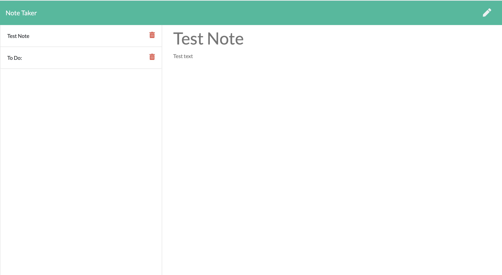

# Note Taker

## Description

This application is designed to allow a user to take notes and save them to a database. Users may create and read notes. The application is live at https://morning-sands-14981.herokuapp.com/

## Installation
To test and edit this application locally, the Node Package Manager must be installed. Just run `npm install`

## Usage
Start the server locally by running `npm start`, then navigate to localhost:3001 in your web browser.

## License
MIT

